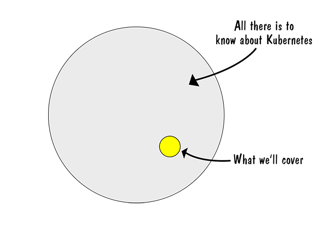

# Kubernetes for the IT Professional

## Introductory Survey

## Scope of Course Content

## Agenda

### Day 1

**Working at Katacoda** [here](https://katacoda.com/courses/kubernetes/playground)

* Lesson 1: Review of Containers
* Lesson 2: K8S Architecture
* Lesson 3: Context and Configs
* Lesson 4: Pods
* Lesson 5: Deployments
* Lesson 6: Liveliness
* Lesson 7: Namespaces
* Lesson 8: Services
* Lesson 9: Horizontal Pod Autoscaler

### Day 2

**Working on the Learner's Laptop**

* Lesson 10: Installing Virtual Box
* Lesson 11: Working with Minikube
* Lesson 12: Persistent Volumes
* Lesson 13: Secrets
* Lesson 14: Ingress
* Lesson 15: Transport Layer Security (TLS)
* Lesson 16: Roles Based Access Control (RBAC)
* Lesson 17: Helm
* Lesson 18: Creating a Cluster with KubeAdm
* Lesson 19: Special Topics (time permitting)
    * Rolling Update
    * Pod Affinity
    * DaemonSets
    * Statefulsets
