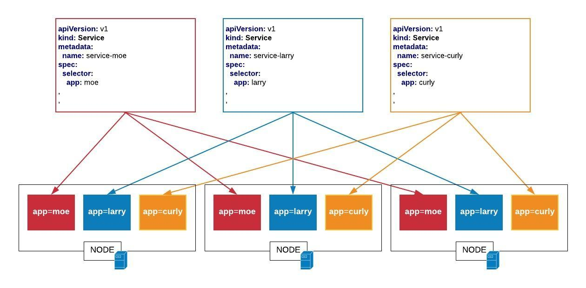
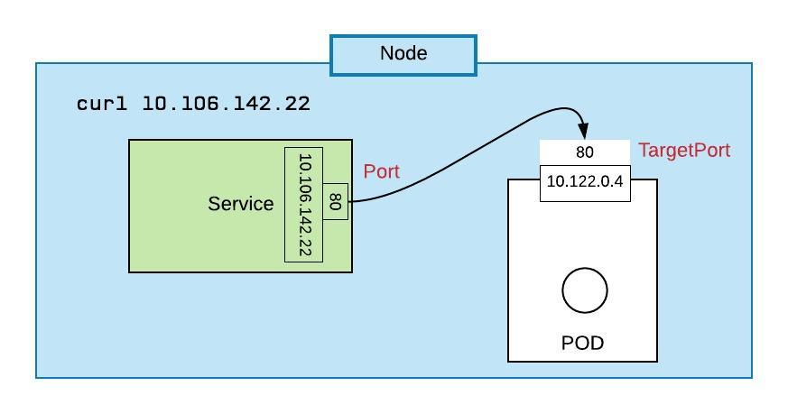
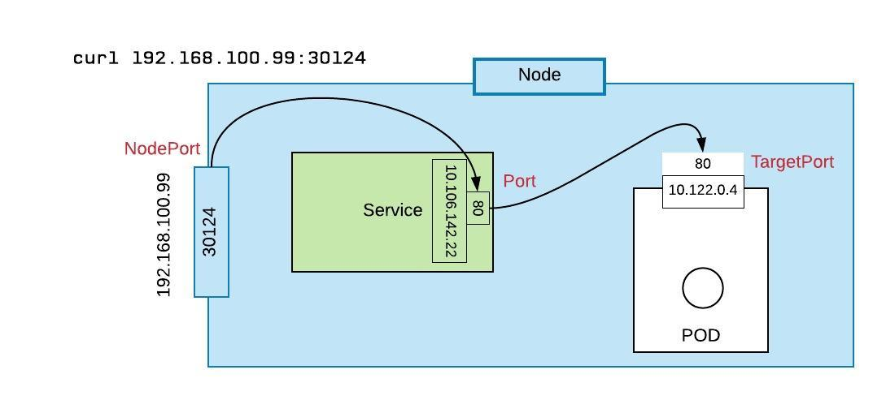
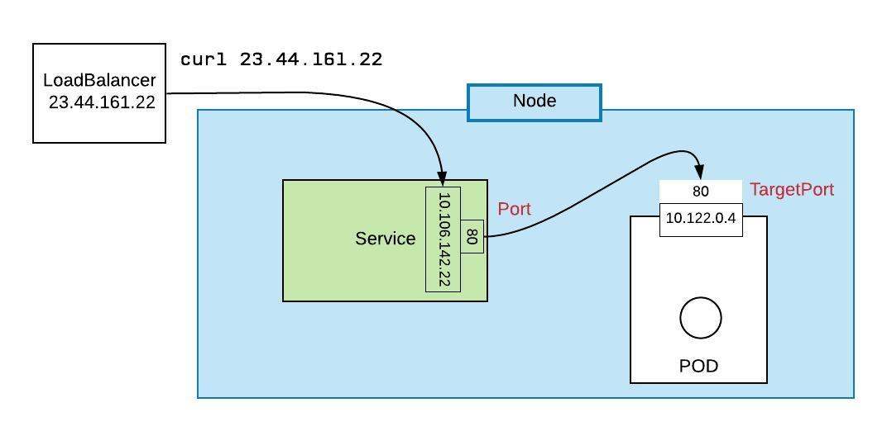

# Kubernetes Services

## Overview



The most important thing to understand is the a service finds it implementation according to labels.

## Cluster IP


## Node Port


## Load Balancer


## Create a Service Imperatively

**Step 1:** Create the deployment:

`kubectl run deployment-demo --image=k8s.gcr.io/hpa-example --requests=cpu=200m --port=80 --replicas=1`

**Step 2:** Create the Service of type, `ClusterIP`:

`kubectl expose deployment deployment-demo --type=NodePort`

**Step 3:** Take a look:

`kubectl get service | grep deployment-demo`

**Step 4:** Let's use `patch` to change the service from ClusterIP to NodePort

`kubectl patch svc deployment-demo --type='json' -p '[{"op":"replace","path":"/spec/type","value":"NodePort"}]'`

**Step 5:** Take another look. Pay attention to `PORT(S)`:

`kubectl get service | grep deployment-demo`

**Step 6:** Let's delete the service:

`kubectl delete service deployment-demo`

**Step 7:** Let's delete the deployment:

`kubectl delete deployment deployment-demo`


## Create a ClusterIP Service Declaratively

We're going to create a deployment declaratively. The name of the deployment is `pinger`. The pinger deployment contains a
pod that has a single container. That container represents an HTTP server written in Node.js that responds
with information about the container's host environment. You can find the source code for pinger
[here](pinger.js).

**Step 1:** Create the deployment:

`kubectl apply -f deployment.yaml`

**Step 2:** Create the service of type, `ClusterIP`

`kubectl apply -f service-cluster-ip.yaml`

**Step 3:** Take a look. Pay attention to `PORT(S)`:

`kubectl get service pinger`

**Step 4:** Let's create an "observer deployment" and use its pod to work in the cluster:

`kubectl run -it deployment-for-testing --image=busybox /bin/sh`

**Step 5:** We can talk to the service, `pinger` using the default dns create by the internal Kubernetes DNS server:

`wget -q -O- http://pinger.default.svc.cluster.local:3000`

**Step 6:** Exit the pod

`exit`

## Convert the Service to NodePort

**Step 1:** Outside of the cluster the service is not visible

`wget -q -O- http://pinger.default.svc.cluster.local:3000`

**Step 2:** Let's make it so we can talk to the cluster:

`kubectl proxy --port=8080`

**Step 3 :** Let's use `curl` to talk to the Kubernetes API server:

`curl http://localhost:8080/api/`

The output will look similar, but not exact. Pay attention to the` serviceAddress`:

```json
{
  "kind": "APIVersions",
  "versions": [
    "v1"
  ],
  "serverAddressByClientCIDRs": [
    {
      "clientCIDR": "0.0.0.0/0",
      "serverAddress": "172.17.0.24:6443"
    }
  ]
}
```

**Step 4:** Take a look at the service. Pay attention to `PORT(S)`:

`kubectl get service pinger`

**Step 5:** Let's try to talk to the default port `PORT(S)`:

`curl http://172.17.0.24:3000`

(Remember to use the `serverAddress` that is particular to your cluster.)

Sorry to report you're going to fail with a `connection refused ` error.

**Step 6:** Now let's reapply another yaml and change the service to type, `NodePort`

`kubectl apply -f service-node-port.yaml`

**Step 5:** Take a look. Pay attention to `PORT(S)`:

`kubectl get service pinger`


**Step 6:** Find the NodePort port for the service:

`kubectrl get service pinger`

Will produce something like this:

```
NAME      TYPE       CLUSTER-IP       EXTERNAL-IP   PORT(S)          AGE
pinger    NodePort   10.106.165.248   <none>        3000:31917/TCP   21m

```

**Step 7:** Call the service from the host's command line using the NodePort:

`curl http://172.17.0.24:31917`

(**Remember!** The IP address of the cluster and the NodePort will vary according to the hosting environment.)

The result from the call to pinger:

```json
{
    "APIVersion": "LESSON_08",
    "startTime": "2019-04-24T15:48:48.609Z",
    "secretMessage": "UNKNOWN",
    "processId": 7,
    "memoryUsage": {
        "rss": 29536256,
        "heapTotal": 7708672,
        "heapUsed": 4628760,
        "external": 8608
    },
    "networkInfo": {
        "lo": [
            {
                "address": "127.0.0.1",
                "netmask": "255.0.0.0",
                "family": "IPv4",
                "mac": "00:00:00:00:00:00",
                "internal": true,
                "cidr": "127.0.0.1/8"
            },
            {
                "address": "::1",
                "netmask": "ffff:ffff:ffff:ffff:ffff:ffff:ffff:ffff",
                "family": "IPv6",
                "mac": "00:00:00:00:00:00",
                "scopeid": 0,
                "internal": true,
                "cidr": "::1/128"
            }
        ],
        "eth0": [
            {
                "address": "10.32.0.2",
                "netmask": "255.240.0.0",
                "family": "IPv4",
                "mac": "f2:dc:59:54:14:52",
                "internal": false,
                "cidr": "10.32.0.2/12"
            },
            {
                "address": "fe80::f0dc:59ff:fe54:1452",
                "netmask": "ffff:ffff:ffff:ffff::",
                "family": "IPv6",
                "mac": "f2:dc:59:54:14:52",
                "scopeid": 12,
                "internal": false,
                "cidr": "fe80::f0dc:59ff:fe54:1452/64"
            }
        ]
    },
    "requestHeaders": {
        "host": "172.17.0.24:31917",
        "user-agent": "curl/7.47.0",
        "accept": "*/*"
    },
    "currentTime": "2019-04-24T16:07:28.999Z",
    "requestUrl": "/",
    "remoteAddress": "::ffff:10.40.0.0"
}
```

## Manifest files

**Deployment yaml (deployment.yaml):**

```yaml
apiVersion: extensions/v1beta1
kind: Deployment
metadata:
  name: pinger
spec:
  replicas: 3
  selector:
    matchLabels:
      app: pinger
  template:
    metadata:
      labels:
        app: pinger
    spec:
      containers:
        - name: pinger
          image: reselbob/pinger
          ports:
            -
              containerPort: 3000
          env:
            - name: CURRENT_VERSION
              value: LESSON_08

```

**Service with Cluster IP yaml (service-cluster-ip.yaml)**
```yaml
apiVersion: v1
kind: Service
metadata:
  name: pinger
spec:
  selector:
    app: pinger
  ports:
  -
    protocol: TCP
    port: 3000
    targetPort: 3000

```


**Service with NodePort yaml (service-node-port.yaml)**

```yaml
apiVersion: v1
kind: Service
metadata:
  name: pinger
spec:
  selector:
    app: pinger
  ports:
  -
    protocol: TCP
    port: 3000
    targetPort: 3000
  type: NodePort
```

