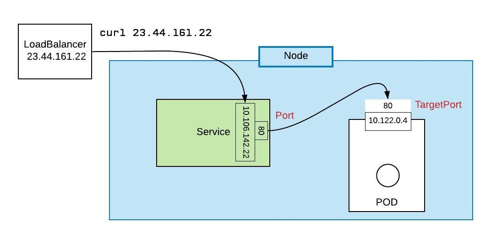

# Kubernetes Services

## Overview

## Cluster IP

## Node Port

## Load Balancer

## Create a Service Imperatively

Create the deployment:

`kubectl run deployment-demo --image=k8s.gcr.io/hpa-example --requests=cpu=200m --port=80 --replicas=1`

Create the Service of type, `ClusterIP`:

`kubectl expose deployment deployment-demo --type=ClusterIP`

Take a look:

`kubectl get service | grep deployment-demo`

Let's use `patch` to change the service from ClusterIP to NodePort

`kubectl patch svc deployment-demo --type='json' -p '[{"op":"replace","path":"/spec/type","value":"NodePort"}]'`

Take another look. Pay attention to `PORT(S)`:

`kubectl get service | grep deployment-demo`

Let's delete the service:

`kubectl delete service deployment-demo`

## Create a Service Declaratively

First, let's create the service of type, `ClusterIP`

`kubectl apply -f service-cluster-ip.yaml`

Take a look. Pay attention to `PORT(S)`:

`kubectl get service | grep deployment-demo`

Now let's reapply another yaml, this time with the service of type, `ClusterIP`

`kubectl apply -f service-cluster-ip.yaml`

Take a look. Pay attention to `PORT(S)`:

`kubectl get service | grep deployment-demo`

Let's create an "observer pod" and use it to work in the cluster:

`kubectl run -it deployment-for-testing --image=busybox /bin/sh`

We can talk to the service, `pinger` using the default dns create by the internal Kubernetes DNS server:

`wget -q -O- http://pinger.default.svc.cluster.local`