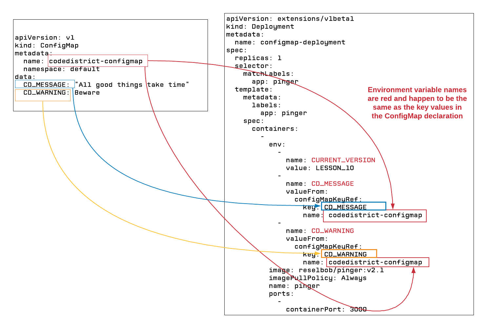

# Config Maps



**Step 1:** Create the ConfigMap in Kubernetes

`kubectl apply -f configmap.yaml`

**Step 2:** Create the deployment that uses the ConfigMaps

`kubectl apply -f configmap-deployment.yaml`

## Manifest files

configmap.yaml

```yaml
apiVersion: v1
kind: ConfigMap
metadata:
  name: codedistrict-configmap
  namespace: default
data:
  CD_MESSAGE: "All good things take time"
  CD_WARNING: Beware
```

configmap-deployment
```yaml

apiVersion: extensions/v1beta1
kind: Deployment
metadata:
  name: configmap-deployment
spec:
  replicas: 1
  selector:
    matchLabels:
      app: pinger
  template:
    metadata:
      labels:
        app: pinger
    spec:
      containers:
        -
          env:
            -
              name: CURRENT_VERSION
              value: LESSON_10
            -
              name: CD_MESSAGE
              valueFrom:
                configMapKeyRef:
                  key: CD_MESSAGE
                  name: codedistrict-configmap
            -
              name: CD_WARNING
              valueFrom:
                configMapKeyRef:
                  key: CD_WARNING
                  name: codedistrict-configmap
          image: reselbob/pinger:v2.1
          imagePullPolicy: Always
          name: pinger
          ports:
            -
              containerPort: 3000
```