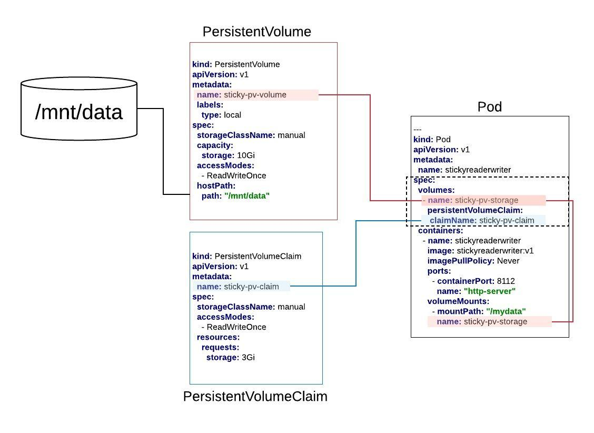

# Persistent Volumes



## Set up the storage
`cd /mnt`

`mkdir data`

`touch /mnt/data/hi.there`

`ls /mnt/data`

## Create the Persistent Volume

`kubectl apply -f sticky-pv.yaml`

## Create the Persistent Volume Claim

`kubectl apply -f sticky-pvc.yaml`

## Deploy the Test Application

`kubectl apply -f sticky-deployment.yaml`

## Make a Request on the Test App

`kubectl get pods | grep stickyreaderwriter`

`kubectl exec -it stickyreaderwriter_A_GUID -- sh`

`curl localhost:8112`

## Check Activity in Storage

`cat /mnt/data/test_file.txt`

## Scale Up the Number of Pods in the Deployment

`kubectl edit deployments/stickyreaderwriter`

Search for, `replicas: 1` under `spec` and change to, `replicas: 4`

## Make a Request on a new Pod

`kubectl exec -it stickyreaderwriter_A_GUID -- sh`

## Check Activity in Storage

`cat /mnt/data/test_file.txt`

## Application Code

```javascript
const http = require('http');
const fs = require('fs');
let i = 0;

const port = process.env.PORT || 8112;

const handleRequest = function(request, response) {
    const fname = '/mydata/test_file.txt';
    const str = `${i} as ${new Date()} for processId: ${process.pid} \n`;
    i++;
    fs.appendFileSync(fname, str, function (err) {
        if (err) {
            return console.log(err);
        }
    });
    console.log('Received request for URL: ' + request.url);
    const contents = fs.readFileSync(fname, 'utf8');
    response.writeHead(200);
    response.end(contents);
}
const www = http.createServer(handleRequest);
www.listen(port, ()=>{
    console.log(`Listening on port ${port}`);
});
```