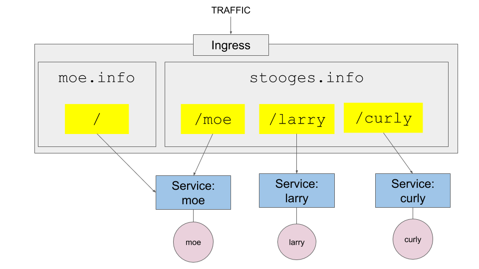

# Working with Kubernetes Ingress

## Implementing an Ingress

**Step 1:** Create the Deployments

`kubectl apply -f moe-deployment.yaml`

`kubectl apply -f larry-deployment.yaml`

`kubectl apply -f curly-deployment.yaml`

**Step 2:** Create the Services

`kubectl expose deployment moe --target-port=3000 --type=NodePort`

`kubectl expose deployment larry --target-port=3000 --type=NodePort`

`kubectl expose deployment curly --target-port=3000 --type=NodePort`

**Step 3:** Set Up the Local DNS to `stooges.info` by making an entry into `/etc/hosts`

`echo "$(minikube ip) stooges.info moe.info" | sudo tee -a /etc/hosts`

**Step 4:** Turn on the minikube ingress

`minikube addons enable ingress`

**Step 5:** Apply the Ingress

`kubectl apply -f ingress.yaml`

## Clean Up

**Step 1:** Clean up

`kubectl delete service moe`

------

`kubectl delete deployment moe`

------

`kubectl delete service larry`

------

`kubectl delete deployment larry`

------

`kubectl delete service curly`

------

`kubectl delete deployment curly`

------

`kubectl delete ingress stooges`

------