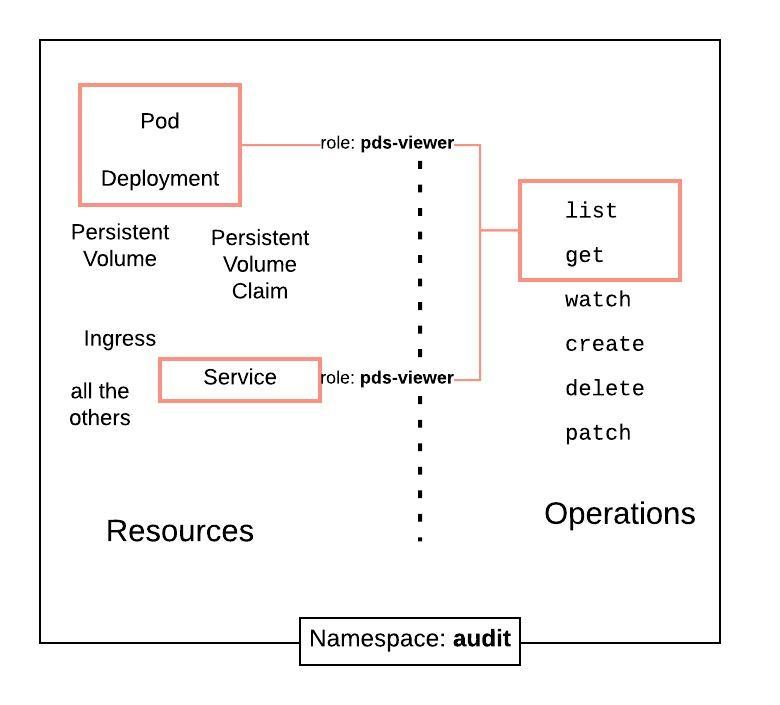
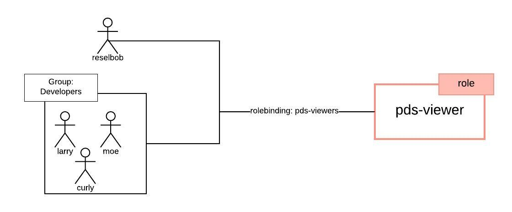
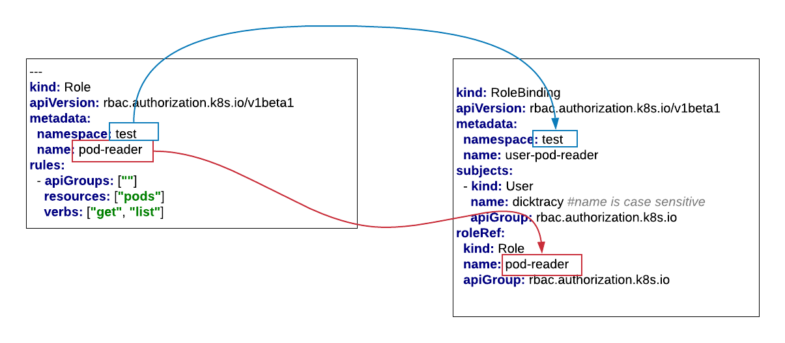
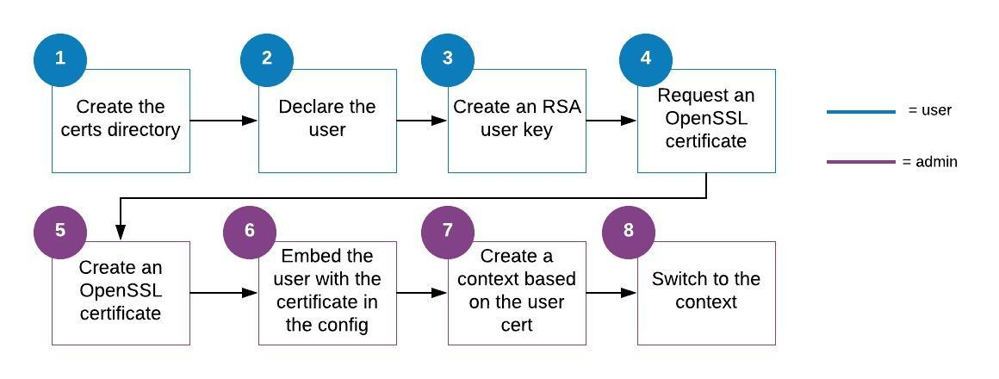

# Roles Based Access Control

## Understanding Subjects, Resources and Operations

## Understanding Roles

## Understanding Role Bindings

## Configuring Role and RoleBinding Manifests

## Review the Certificate Creation Process

## Creating the Certificates

**Step 1:** Declare the name of the Kubernetes user we're going to support by setting it to an environment
variable

`export MAGIC_USER=dicktracy`

**Step 2:** Generate the public ssl key

`openssl genrsa -out ~/.minikube/${MAGIC_USER}.key 2048`

**Step 3:** Make a `private key` and a `certificate signing request` that applies to the user we created and the groups, `devs`
and `tech-leads`

`openssl req -new -key "~/.minikube/${MAGIC_USER}.key" -out ${MAGIC_USER}.csr -subj "/CN=${MAGIC_USER}/O=devs/O=tech-leads"`

------

Now we'll put on an "System Adminstrator Hat" and create the `public certificate`

------

**Step 4:** Create the public certificate

`openssl x509 -req -in ~/.minikube/${MAGIC_USER}.csr -CA ~/.minikube/ca.crt -CAkey ~/.minikube/ca.key -CAcreateserial -out ~/.minikube/${MAGIC_USER}.crt -days 500`

**Step 5:** Set the certificate as credential a key

`kubectl config set-credentials ${MAGIC_USER}@minikube --client-certificate="~/.minikube/${MAGIC_USER}.crt" --client-key="~/.minikube/${MAGIC_USER}.key" --embed-certs=true`

**Step 6:** Create a new Kubernetes context

`kubectl config set-context ${MAGIC_USER}@minikube --cluster=minikube --user=${MAGIC_USER}@minikube`

## Create the Required Namespaces

**Step 1:** Execute the manifest that contains declarations for the namespaces, `devs` and `test`

`kubectl apply -f namespaces.yaml`
 
 **Step 2:** Check that the namespaces have been created
 
 `kubectl get ns`
 
## Create Roles and RoleBindings for a User

**Step 1:** Create the `pod-access` role that allows only using `kubectl get`

`kubectl apply -f pod-reader.yaml`

**Step 2:** Create the rolebinding, `user-pod-reader` that allows the user, `dicktracy` to assume the 
role, `pod-reader`.

`kubectl apply -f user-pod-reader-rolebinding.yaml`

## Verifying RBAC

**Step 1:**  Move into the context that supports `dicktracy`

`kubectl config use-context ${MAGIC_USER}@minikube`

**Step 2:** Try to create a pod in the namespace, `test`

`kubectl run --generator=run-pod/v1 pinger-dk --image=reselbob/pinger:v2.1 -n test`

You'll fail.

**Step 3:** You'll fail, so let's go back to being the admin in `minikube`.

 `kubectl config use-context minikube`
 
**Step 4:** Try to create a pod again

`kubectl run --generator=run-pod/v1 pinger-dk --image=reselbob/pinger:v2.1 -n test`

**Step 5:** As the `minikube` admin, take a look to see that the pod is in the namespace, `test`

`kubectl get pods -n test`

**Step 6:** Now, switch back to be `dicktracy`

`kubectl config use-context ${MAGIC_USER}@minikube`

**Step 7:** As the user `dicktracy`, take a look to see that the pod is in the 
namespace, `test`

`kubectl get pods -n test`

**Step 8:** Try to get a list of pods in all the namespaces

`kubectl get pods --all-namespaces`

**SUPRISE! You can't do it. Dick Tracy does not have permission to list pods at the cluster scope.**

## Create Roles and RoleBindings for Groups

**Step 1:** Switch back to being the admin in `minikube`.

 `kubectl config use-context minikube

**Step 2:** Create the `simple-pod-developer` role that allows creating and listing pods

`kubectl apply -f simple-dev-role.yaml`

**Step 3:** Create the rolebinding, `simple-pod-developers` that allows the group, `devs` to assume the 
role, `simple-pod-developer`.

`kubectl apply -f simple-dev-rolebinding.yaml`

**Step 4:** Now, switch back to be `dicktracy`

`kubectl config use-context ${MAGIC_USER}@minikube`