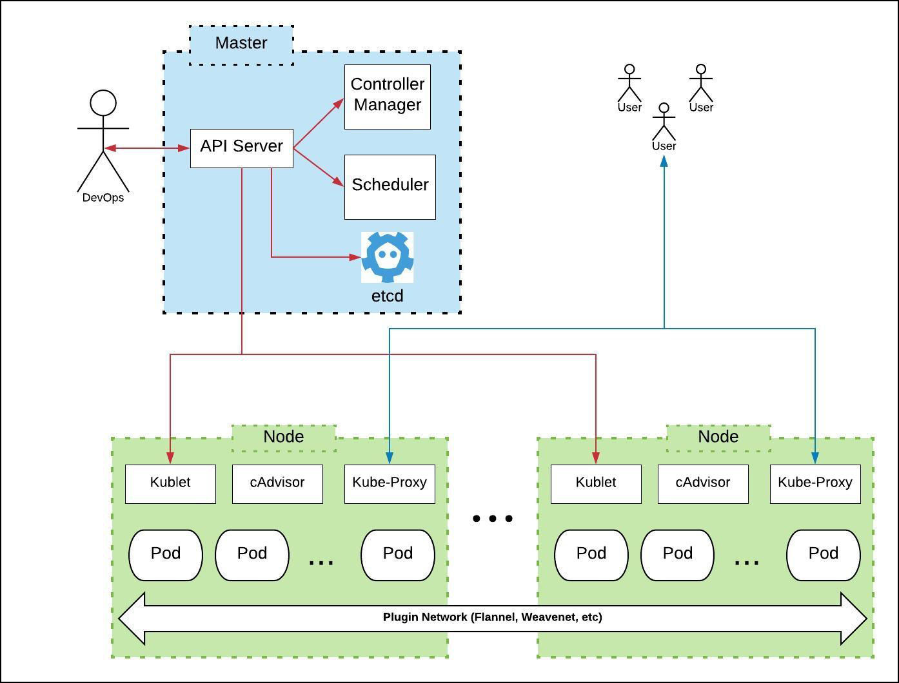
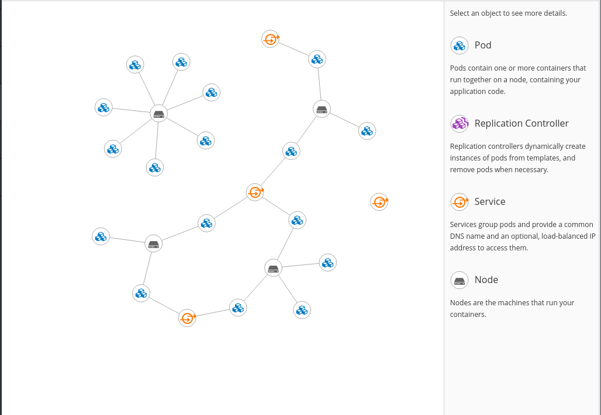

# Kubernetes Architecture

## The Control Plane

### etcd

etcd is a persistent, lightweight, distributed, key-value data store developed by CoreOS that reliably stores the configuration data of the cluster, representing the overall state of the cluster at any given point of time. Other components watch for changes to this store to bring themselves into the desired state

### API Server

The API server is a key component and serves the Kubernetes API using JSON over HTTP, which provides both the internal and external interface to Kubernetes.The API server processes and validates REST requests and updates state of the API objects in etcd, thereby allowing clients to configure workloads and containers across Worker nodes

### Scheduler
The scheduler is the pluggable component that selects which node an unscheduled pod (the basic entity managed by the scheduler) runs on, based on resource availability. Scheduler tracks resource use on each node to ensure that workload is not scheduled in excess of available resources. For this purpose, the scheduler must know the resource requirements, resource availability, and other user-provided constraints and policy directives such as quality-of-service, affinity/anti-affinity requirements, data locality, and so on. In essence, the scheduler’s role is to match resource "supply" to workload "demand"

### Controller Manager
The controller manager is a process that runs core Kubernetes controllers like DaemonSet Controller and Replication Controller. The controllers communicate with the API server to create, update, and delete the resources they manage (pods, service endpoints, etc.)

## The Other Guys

### Kubelet
Kubelet is responsible for the running state of each node, ensuring that all containers on the node are healthy. It takes care of starting, stopping, and maintaining application containers organized into pods as directed by the control plane. Kubelet monitors the state of a pod, and if not in the desired state, the pod re-deploys to the same node. Node status is relayed every few seconds via heartbeat messages to the master. Once the master detects a node failure, the Replication Controller observes this state change and launches pods on other healthy nodes
### Container
A container resides inside a pod. The container is the lowest level of a micro-service that holds the running application, libraries, and their dependencies. Containers can be exposed to the world through an external IP address.
### Kube-proxy
The Kube-proxy is an implementation of a network proxy and a load balancer, and it supports the service abstraction along with other networking operation. It is responsible for routing traffic to the appropriate container based on IP and port number of the incoming request.
### cAdvisor
cAdvisor is an agent that monitors and gathers resource usage and performance metrics such as CPU, memory, file and network usage of containers on each node.

# Topology

