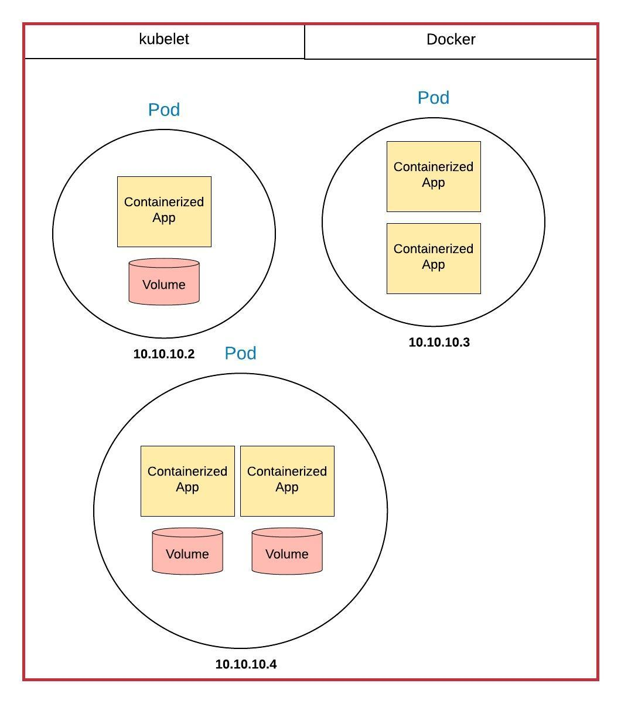

# Pods



## Create a pod with one container declaratively

```bash
kubectl apply -f ./simplepod.yaml
```

The manifest:
```yaml
apiVersion: v1
kind: Pod
metadata:
  name: simplepod
  labels:
    app: simplepod
spec:
  containers:
  - name: simplepod
    image: nginx
    ports:
      - name: app
        containerPort: 3000
    env:
      - name: CURRENT_EXERCISE_VERSION
        value: LESSON_04
```

To access the `nginx` container type, `kubectl exec -it simplepod -- sh`

## Create a pod with two containers declaratively

```bash
kubectl apply -f ./complexpod.yaml
```

To access the `hpa-example` container type, `kubectl exec -it complexpod  --container hpa-example -- sh`

The manifest:

```yaml
apiVersion: v1
kind: Pod
metadata:
  name: complexpod
  labels:
    app: complexpod
spec:
  containers:
  - name: nginx
    image: nginx
    ports:
      - name: app
        containerPort: 80
    env:
      - name: CURRENT_EXERCISE_VERSION
        value: LESSON_04
  - name: hpa-example
    image: k8s.gcr.io/hpa-example
    ports:
      - name: app
        containerPort: 3000
    env:
      - name: CURRENT_EXERCISE_VERSION
        value: LESSON_04
```

## List pods

`kubectl get pods`

`kubectl get pods --all-namespaces`

## Describe a pod

`kubectl describe pod simplepod`

## Delete a pod

`kubectl delete pod simplepod`