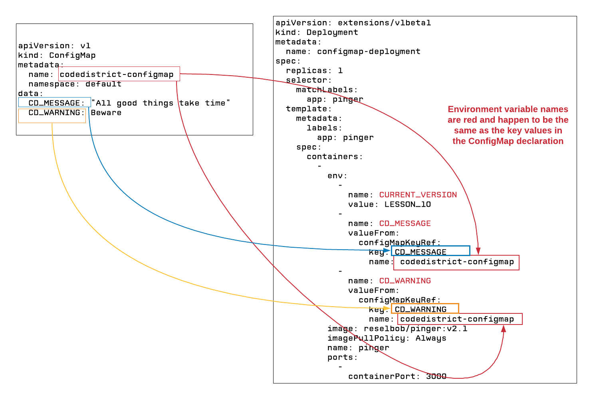

# Config Maps



**Step 1:** Create the ConfigMap in Kubernetes

`kubectl apply -f configmap.yaml`

**Step 2:** Create the deployment that uses the ConfigMaps

`kubectl apply -f configmap-deployment.yaml`

**Step 3:** Get the name of the pod the deployment created

`kubectl get pod | grep configmap-deployment`

result"

```
configmap-deployment-fc678f655-frn62   1/1       Running   0          29m

```

**Step 4:** Use the pod name to go directly into the `pinger` container.

`kubectl exec -it configmap-deployment-A_GUID sh`

You see a command prompt like so:

`/ #`

**Step 5:** At the command prompt internal to the container, do a `wget` call within the container to get a response from the`pinger` web server.

`wget -q -O- http://localhost:3000`


Sample result:

```json
{
    "APIVersion": "LESSON_10",
    "startTime": "2019-04-25T18:28:28.361Z",
    "secretMessage": "UNKNOWN",
    "processId": 7,
    "memoryUsage": {
        "rss": 30007296,
        "heapTotal": 7708672,
        "heapUsed": 4628840,
        "external": 8608
    },
    "networkInfo": {
        "lo": [
            {
                "address": "127.0.0.1",
                "netmask": "255.0.0.0",
                "family": "IPv4",
                "mac": "00:00:00:00:00:00",
                "internal": true,
                "cidr": "127.0.0.1/8"
            },
            {
                "address": "::1",
                "netmask": "ffff:ffff:ffff:ffff:ffff:ffff:ffff:ffff",
                "family": "IPv6",
                "mac": "00:00:00:00:00:00",
                "scopeid": 0,
                "internal": true,
                "cidr": "::1/128"
            }
        ],
        "eth0": [
            {
                "address": "10.32.0.3",
                "netmask": "255.240.0.0",
                "family": "IPv4",
                "mac": "22:c2:c7:7d:7f:d3",
                "internal": false,
                "cidr": "10.32.0.3/12"
            },
            {
                "address": "fe80::20c2:c7ff:fe7d:7fd3",
                "netmask": "ffff:ffff:ffff:ffff::",
                "family": "IPv6",
                "mac": "22:c2:c7:7d:7f:d3",
                "scopeid": 16,
                "internal": false,
                "cidr": "fe80::20c2:c7ff:fe7d:7fd3/64"
            }
        ]
    },
    "envVars": {
        "KUBERNETES_SERVICE_PORT": "443",
        "KUBERNETES_PORT": "tcp://10.96.0.1:443",
        "CURRENT_VERSION": "LESSON_10",
        "NODE_VERSION": "8.9.4",
        "CD_WARNING": "Beware",
        "YARN_VERSION": "1.3.2",
        "HOSTNAME": "configmap-deployment-fc678f655-frn62",
        "SHLVL": "1",
        "HOME": "/root",
        "KUBERNETES_PORT_443_TCP_ADDR": "10.96.0.1",
        "PATH": "/usr/local/sbin:/usr/local/bin:/usr/sbin:/usr/bin:/sbin:/bin",
        "KUBERNETES_PORT_443_TCP_PORT": "443",
        "KUBERNETES_PORT_443_TCP_PROTO": "tcp",
        "CD_MESSAGE": "All good things take time",
        "KUBERNETES_PORT_443_TCP": "tcp://10.96.0.1:443",
        "KUBERNETES_SERVICE_PORT_HTTPS": "443",
        "PWD": "/",
        "KUBERNETES_SERVICE_HOST": "10.96.0.1"
    },
    "requestHeaders": {
        "host": "localhost:3000",
        "user-agent": "Wget",
        "connection": "close"
    },
    "currentTime": "2019-04-25T18:29:42.971Z",
    "requestUrl": "/",
    "remoteAddress": "::ffff:127.0.0.1"
}
```

Notice that the environment variables,  `CD_MESSAGE` and `CD_WARNING` show the values
assigned from the ConfigMap.

## Manifest files

configmap.yaml

```yaml
apiVersion: v1
kind: ConfigMap
metadata:
  name: codedistrict-configmap
  namespace: default
data:
  CD_MESSAGE: "All good things take time"
  CD_WARNING: Beware
```

configmap-deployment
```yaml

apiVersion: extensions/v1beta1
kind: Deployment
metadata:
  name: configmap-deployment
spec:
  replicas: 1
  selector:
    matchLabels:
      app: pinger
  template:
    metadata:
      labels:
        app: pinger
    spec:
      containers:
        -
          env:
            -
              name: CURRENT_VERSION
              value: LESSON_10
            -
              name: CD_MESSAGE
              valueFrom:
                configMapKeyRef:
                  key: CD_MESSAGE
                  name: codedistrict-configmap
            -
              name: CD_WARNING
              valueFrom:
                configMapKeyRef:
                  key: CD_WARNING
                  name: codedistrict-configmap
          image: reselbob/pinger:v2.1
          imagePullPolicy: Always
          name: pinger
          ports:
            -
              containerPort: 3000
```